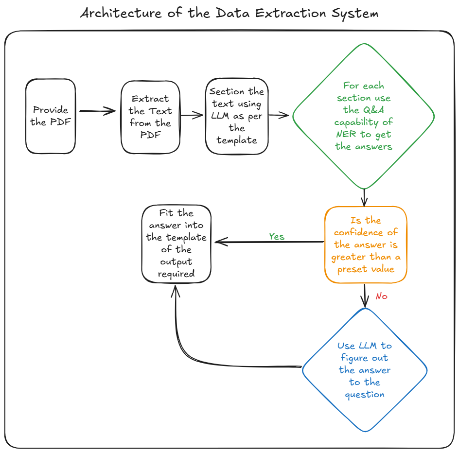

# **Document Analyzer**

## **Description**
This project allows you to read PDF files and extract text from them, in a format that is suitable for processing the shipping booking confirmation.

---

## **Table of Contents**

1. [Features](#features)  
2. [Installation](#installation)  
3. [Usage](#usage)  
4. [Technologies Used](#technologies-used)
5. [Architecture](#architecture)

---

## **Features**
- **Feature 1**: The project allows you to extract text from a PDF in the form of a JSON object.
- **Feature 2**: It also allows you to translate the extracted text into English.
- **Feature 3**: It contextually splits the text into different sections based on our requirements.
- **Feature 4**: It uses NER to capture the answers required to fill the shipping booking confirmation template.
- **Feature 5**: The process also has a fallback implemented in case of low confidence in the answers with NER using Groq.
- **Feature 6**: Retry logic is implemented for all GROQ API calls as we are using the free version to handle any issues. 

---

## **Installation**

### Prerequisites
The requirements of the project are specified in the `reuqirements.txt` file.

You must have conda or miniconda installed on your system to use the project.

The project used Python 3.10.

### Steps to Install
Follow these steps to set up the project locally:

Clone the repository:
```bash
git clone https://github.com/BabyCoder69/multilingual_doc_reader_ner.git
```
You must first create a virtual environment using the following command:

```bash
conda create -n project-name python=3.10
```
Then activate the virtual environment:
```bash
conda activate project-name
```
Then install the requirements using the following command:
```bash
pip install -r requirements.txt
```

---

## **Usage**

Define the path of the PDF you need to be processed inside the `main.py` file.

Run the following command to run the project:
```bash
python main.py
```

The output of the project will be a JSON object containing the extracted text from the PDF and the answers to be filled in the shipping booking confirmation template.
An example of the output can be found in the `example_output.json` file. It has been generated by running the project on the PDF provided in the problem statement.


---

## **Technologies Used**
- Python 3.10
- GliNER ( NER model from Hugging Face)
- PDFPlumber (For extracting text from PDF)
- Groq (For getting the answers to the questions using LLM and for contextual splitting of the text)

---

## **Architecture**

The project uses the following architecture:




---

## **Note**

The performance of the project can be affected by the quality of the LLM used, here we are using the free version of Groq. 
So it is subject to availability and slightly less control over the quality of the answers. 
The output can be improved by using a paid version of LLM.